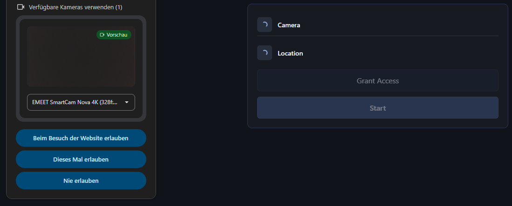
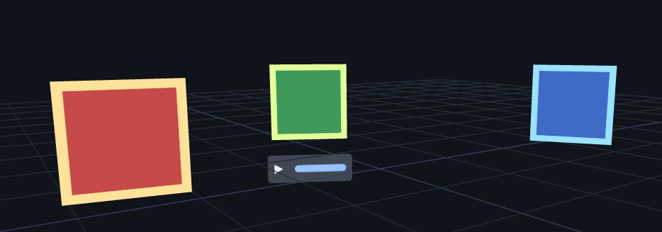
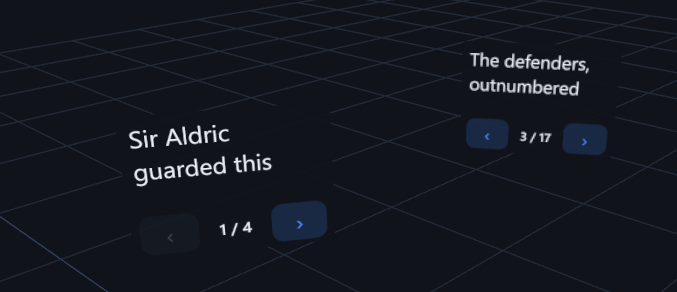
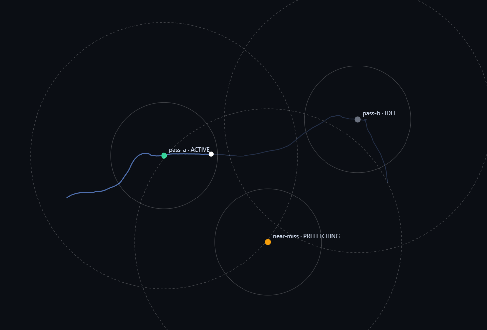
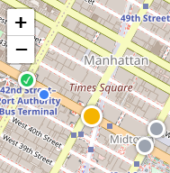

## Title Page

GPS+SLAM Tour Builder
(Screenshot of Tour on phone)
Maria Elia & Nico Hellthaler · Software Lab · Final Presentation

[no other text]

---

## Introduction (1.)

### The Vision

AR tour building app for:
 - historic sites
 - city tours
 - museum tours 

---

Easy to use:
 - Tour creators:
    - Walk tour once or simply via Desktop Map
    - Drag & Drop Waypoints
    - Upload to Dropbox -> create QR Code

 - Visitors:
    - Scan QR Code once
    - Walk whole tour without needing Wifi
    - Enjoy images, text + audio

[One column for each]

---

### How did we get there?

1. build components
2. Combine

3. Iterate
4. Iterate
5. Iterate

--- 

Components:
 - onboarding (prompt for camera + location) 
 - tour data model + store (our data model) (tour.json as example)
 - authoring components:
    - packaging (tour.json + assets -> zip and hosted zip link -> qr + tour link)
    - cloud-storage (fetch relevant data from hosted zip from DropBox/OneDrive/GoogleDrive)
    - authoring (UI to enter tour name + drop waypoints + allow tour-link creation) (updated authoring view screenshot from deployed app)
 - walk tour components:
    - billboard (floating clickable image + audio) 
    - in-world-text (floating, navigatable text) 
    - proximity (detect user proximity to waypoint for asset fetching and visibility toggling) 
    - 2d map (simple OSM map to display user location + waypoints) 
    - ar scene (composite threejs scene to put everything together)

[Slide-show-ish. Images only / json code for data model]

---

## Challenges & Roadblocks (5.)

- no AR phone, no funny (no phone image)
- envision final app at the start

---

Technical challenges:
- HTML-in-3D vs Canvas
- altitude? Ignore or include (multiple story buildings) -> ignore
- CORS (Google Drive) -> use proxy
- Link manipulation (dl=0, encodeURI, proxy)

---

## Key Learnings (2. & 3.)

 - UX and responsive design is DIFFICULT

---

## Helpful Tools & Workflows (2., 3., 6.)

stay up-to-date with upstream -> use new features (OSM)
context and structure management: -> better LLM output + easier debugging
 - task as md, claude.md
 - conventional commits
 - feature branches
skills: superpowers (plan first + tdd + interactive UI design) -> more directed changes, less undesired behaviour
github pages -> testable and usabe deployment

[arrows with advantages show up one by one on next press]

---

## Our App (4.)

Desktop: Demo Video of Authoring after polish

--- 

    + NYC Tour before polish

--- 

Phone: Demo Video of Walking a Tour after polish

---

## Summary & Questions

14 weeks of weekly meetings (~4hrs each)
130+ commits
40.000+ LOC